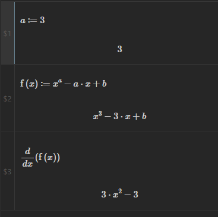
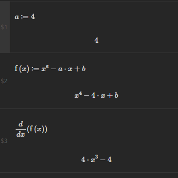

# Mathpad Documentation
Mathpad consists on three main method of execution symbolic and numeric calculations:

- The Sidebar
- Inline Code blocks
- Code Islands

# Sidebar

The sidebar consists of an input at the bottom, in which you can enter:
- expressions like 
    `2+5`
    or
    `solve(x^2-4)`
- variable declaration like 
    `a:=42`
- function definitions like:
    `f(x):=x+9`

(For the whole list of expressions that can be used please see [here](functions.md))

The result of these commands will be displayed in a "stack" that keeps the history of the expressions and will allow to edit them and to refer to them with variables. The name of the variable is the name of the slot, for example `$1`.

The stack are evaluated in order, this is important for variables. Changing a slot will cause all dependant slots to be updated. This is useful when using variables to see the impact of a different value on other computations.

| a:=3                 | a:=4                 |
|----------------------|----------------------|
|  |  |

## Evaluation

The sidebar has a toggle button that determines how the engine will evaluate the expression. If it is set to "symbolic" the engine will refrein to completely evaluate an expression, to avoid losing precision. This could lead also to results being reported as fractions.
By setting it as "numeric" it will force evaluation and will cause numeric results to be reported as decimal numbers.
The engine will, however, return symbolic results whenever possible and whenever it is not possible to give a numeric answer.

## Plotting

Plots are done with a special command, for example:

`plot(sin(x))`

will produce the following

The plot can be panned and zoomed. The value of the new pan and zoom will be kept if the slot will be copied as code block (see later).

To plot more than one function:

`plot(sin(x),cos(x))`

If a particular domain (range) of values for x or y must be specified, it can be done in the following way.

To specify a specific range for x (y will be kept in a 1:1 aspect ratio):

`plot(sin(x),[-3.14, 3.14])`

To specify a range also for y:

`plot(sin(x),[-3.14, 3.14], [-1, 1])`

# Code Block

# Inline Block

# Settings
