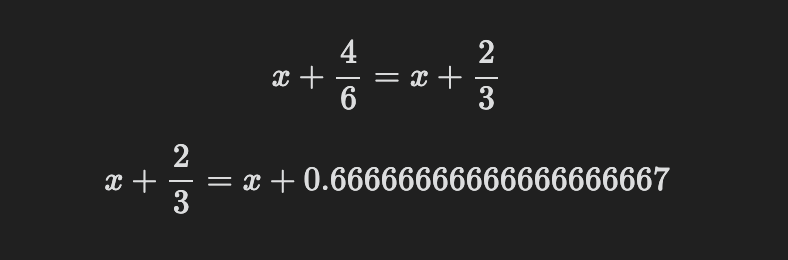

# Mathpad Documentation
Mathpad consists on three main method of execution symbolic and numeric calculations:

- The Sidebar
- Inline Code blocks
- Code Islands


# Sidebar


The sidebar consists of an input at the bottom, in which you can enter:
- expressions like 
    `2+5`
    or
    `solve(x^2-4)`
- variable declaration like 
    `a:=42`
- function definitions like:
    `f(x):=x+9`

(For the whole list of expressions that can be used please see [here](functions.md))

The result of these commands will be displayed in a "stack" that keeps the history of the expressions and will allow to edit them and to refer to them with variables. The name of the variable is the name of the slot, for example `$1`.


The stack are evaluated in order, this is important for variables. Changing a slot will cause all dependant slots to be updated. This is useful when using variables to see the impact of a different value on other computations.


## Evaluation

The sidebar has a toggle button that determines how the engine will evaluate the expression. If it is set to "symbolic" the engine will refrein to completely evaluate an expression, to avoid losing precision. This could lead also to results being reported as fractions.
By setting it as "numeric" it will force evaluation and will cause numeric results to be reported as decimal numbers.
The engine will, however, return symbolic results whenever possible and whenever it is not possible to give a numeric answer.


## Plotting

Plots are done with a special command, for example:

`plot(sin(x))`

will produce the following


The plot can be panned and zoomed. The value of the new pan and zoom will be kept if the slot will be copied as code block (see later).

To plot more than one function:

`plot(sin(x),cos(x))`


If a particular domain (range) of values for x or y must be specified, it can be done in the following way.

To specify a specific range for x (y will be kept in a 1:1 aspect ratio):

`plot(sin(x),[-3.14, 3.14])`

To specify a range also for y:

`plot(sin(x),[-3.14, 3.14], [-1, 1])`


## Sidebar commands

On the top of the sidebar there are commands that help manipulating the expressions already inserted in some slot: *derivate*, *integrate*, *solve*, *expand*, *simplify*
On each Slot there are four buttons, the first will delete the slot.
The second will copy the expression of the slot (and all the variables in scope) to a code block in the active view. This works also for plots and it will retain the zoon and panning.
The third and fourth will copy the input or the result respectively as LaTeX in the active view. If the active view is not editable it will be copied to the clipboard.
Clicking on the result will copy it in the input.

# Code Block

Mathpad code blocks are created the usual way:

    ```mathpah
    ```

inside it you can put the same commands you would put in the sidebar.
When mathpad expressions are evaluated and rendered,they obay to some defaults found in the settings:

`Evaluate Results` will defaults to evaluatig expressions to numeric, when possible
`Prefer Block LaTeX` will defaults to rendering LaTeX as block

You can force some particular expression to be be kept more symbolic even if the defaults is to evaluate by using the following syntax:

`x+2/3==?`

You can force it to be evaluated to numeric with the following one:

`x+2/3=~?`

    ```mathpad
    x+4/6==?
    x+2/3=~?
    ```
will render as:



You can end an expression with only `=?`, this is needed in inline blocks (see later) but not in code blocks. It will use the default evaluation as specified in the settings.

To force a block rendering, regardless of the default, use a leading `$` sign, to force an inline rendering use a `-` sign:

    ```mathpad
    sin(pi)=?$
    cos(pi)=?-
    ```

will be rendered as follows:


To hide an expression from the rendering prefix it with a `%` sign (this only works with code blocks)


# Inline Block

Using inline blocks allows to use Obsidian as a "smart calculator", by inserting expressions inide any note. Expressions will be evaulated also while in edit mode and you can have the result rendered in LaTeX inlinr or in block mode, according to preferences.

Declaration are inserted as usual:

    `a:=42`
    `f(x):=x+2`

Evaluation of expression must instead use one either `=?` or `=~?` or `===?`:

    `f(a)==?`


Note that changing something will cause an instant recalculation giving you updated results while in edit mode.

`=?` will evaluate the expressions according to the default setting. `=~?` will force an evaluation while `==?` will force a symbolic/fractional result.

In the settings you can decide whether you prefer an inline rendering or a block rendering by default. You can however force it one way or another using the same syntax seen before for code blocks.
For example the following text will render in the follwing ways, according to what is the default.

    Since a dozen eggs price is `dozen:=1.5`  and I need `num:=17` eggs, it should cost `num*(dozen/12)=?`

If `prefer latex as block` is on:


If it's off:


Note that the rendering above was also the result of having `Evaluate Results` off.
In order to force evaluation use the `=~?` syntax instead of `=?`


    Since a dozen eggs price is `dozen:=1.5`  and I need `num:=17` eggs, it should cost `num*(dozen/12)=~?`


If you have inline rendering on, and you want to render something as a block, end the expression with a `$` sign:

    Since a dozen eggs price is `dozen:=1.5`  and I need `num:=17` eggs, it should cost `num*(dozen/12)=~?$`


On the other way, if you have `Prefer Block LaTeX` on and you want to force inline rendering, ends the inline code with a `-` sign.

    Since a dozen eggs price is `dozen:=1.5-`  and I need `num:=17-` eggs, it should cost `num*(dozen/12)=~?`

It will render the same as above.

You an also generate plots using inline code:

    `plot(x^2-2)=?`

Note that they will be rendered as block elements regardless of settings.

# Settings

Available settings are:

## Add Ribbon Icon
Will ad an icon to Obsidian ribbon bar that can be used to open the Sidebar

## Show Mathpad Sidebar
Will open the sidebar upon start

## Copy as Block LaTeX
When copying from the sidebar either the input or the result, they will rendered as inline LaTeX or inline LaTeX accordingly.

## Prefer Block LaTeX for inline
Default render mode for inline mathpad.
A different rendering can be forced by ending the expression with a `$` for block rendering, or `-` for inline rendering.

## Prefer Block LaTeX for code blocks
Default render mode for mathpad code blocks.
A different rendering can be forced by ending the expression with a `$` for block rendering, or `-` for inline rendering.

## Evaluate Results
If on, the default result of mathpad when using `=?` will be to get to a numeric result, even if approximate. If off, mathpad will keep the result more symbolic (will avoid evaluating fractions and to evaluate functions that implies a numeric result).
Either mechanism cn be forced by using `=~?` for full evaluation and `==?` for symbolic evaluation.

## Plot Grid
If on, grid lines will be shown in the plots.

## Plot Width
Set it in order to have the plots rendered at a fixed width inside notes. Leave it at 0 in order to make it adapt to the actual view size. Plot width is limited to the 200-700 pixels range. Reading views might need to be re-opened for the size to adjust.

## Plot Tangents
If enabled, the plot will also draw the tangents to the functions where the mouse hovers:


## Precision
Precision for displaying results as decimal
